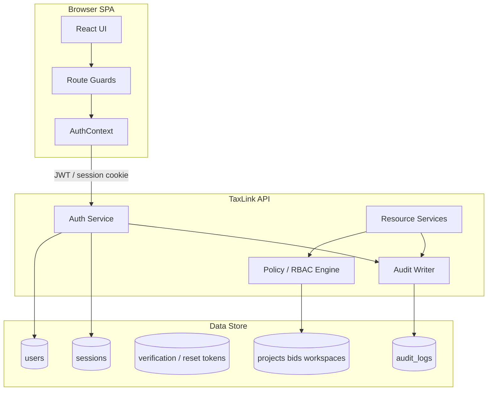
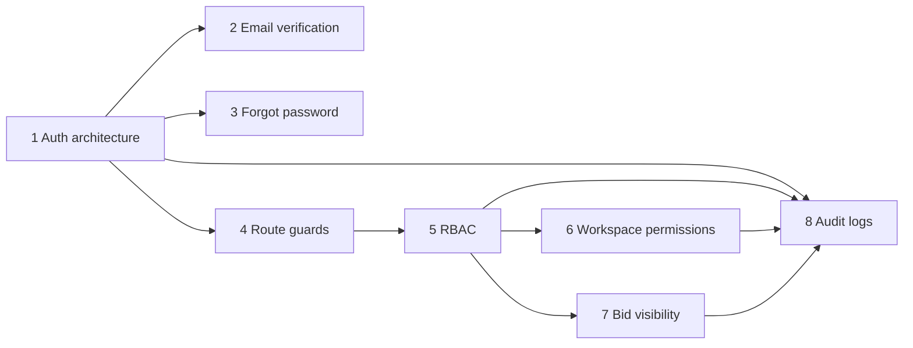
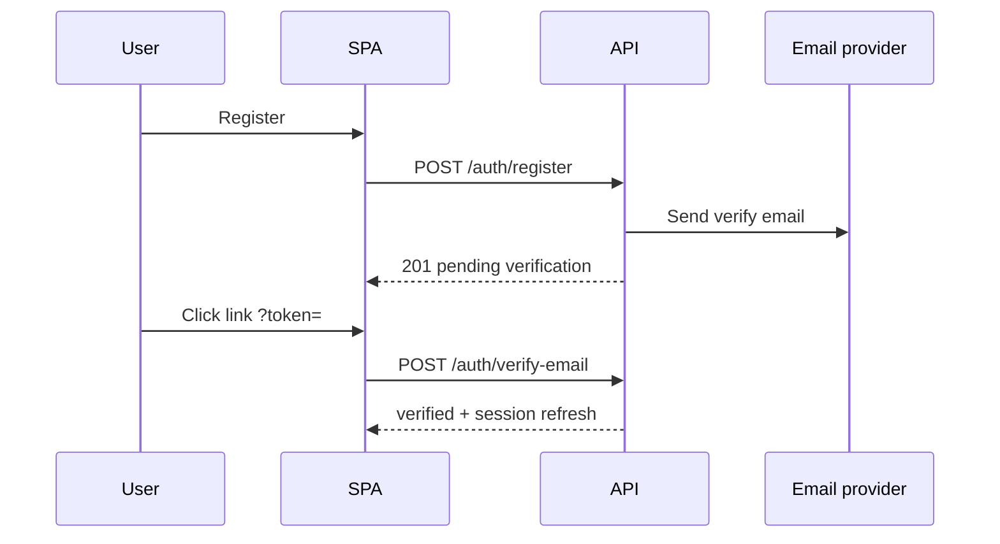
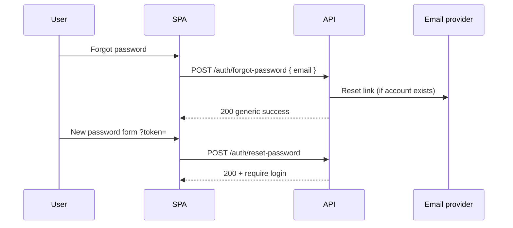

# TaxLink Phase 2 — Security Implementation Roadmap

**Status:** Planning (documentation only — no implementation)  
**Date:** May 2026  
**Prerequisite:** [taxlink-v1-product-architecture.md](./taxlink-v1-product-architecture.md) (Phase 1 foundation)  
**Closes gaps from:** [permission-matrix-audit.md](./permission-matrix-audit.md) · [taxlink-permission-matrix.md](./taxlink-permission-matrix.md)

Phase 2 moves TaxLink from a **local-first SPA with client-trusted permissions** to a **server-enforced security model**. This roadmap prioritises authentication, verification, route guards, RBAC, workspace and bid isolation, and audit logging.

**Explicitly out of Phase 2 scope:** 2FA, AI matching, AML/CDD automation, engagement letter generation, reputation scoring.

---

## 1. Goals and success criteria

| Goal | Success metric |
|------|----------------|
| Trust boundary on server | No marketplace mutation without validated session + policy check |
| Identity | Real credentials (email + password); verified email before sensitive actions |
| Least privilege | Each role sees only permitted routes and data |
| Bid confidentiality | Professionals never receive competitors’ bid payloads |
| Workspace isolation | Only `WorkspaceMember` records access room data |
| Accountability | Security-relevant actions written to append-only audit log |
| Audit remediation | All **Critical** and **High** findings in [permission-matrix-audit.md](./permission-matrix-audit.md) closed |

---

## 2. Current state (baseline)

| Area | Today | Risk |
|------|-------|------|
| Auth | `taxlink_auth_session` in `localStorage`; `auth.login()` restores profile without password | Identity spoofing |
| Verification | No email verification | Unverified accounts perform marketplace actions |
| Password reset | Not implemented | Account lockout / support burden |
| Route guards | `ProtectedRoute` exists but unused in `App.jsx` | Direct URL access |
| RBAC | `user_role` in `localStorage`; nav-only in Phase 1 | Wrong-role actions |
| Workspace | UI checks in `ProjectWorkspace.jsx`; store layer open | Data leak + mutation bypass |
| Bids | `ProjectOwnerBids` public; `MyProjects` loads all bids | Competitive intelligence leak |
| Audit | None | No forensic trail |

**Root cause:** Permissions enforced in React + `localStorage` only ([permission-matrix-audit.md](./permission-matrix-audit.md) §Executive summary).

---

## 3. Phase 2 architecture (target)



### 3.1 Design principles

1. **Server is source of truth** — `localStorage` holds tokens/preferences only, not authoritative entity data.
2. **Deny by default** — policy engine returns explicit allow; missing rule = deny.
3. **Defense in depth** — route guard (UX) + API middleware (enforcement).
4. **User-centric IDs** — all foreign keys use `user_id` (see Phase 1 user model).
5. **Audit on write** — auth events, awards, admin actions, permission denials (sampled).

### 3.2 Recommended stack choices (decision record)

| Decision | Recommendation | Rationale |
|----------|----------------|-----------|
| Session transport | **HttpOnly secure cookie** (same-site) or **short-lived JWT + refresh rotation** | Reduces XSS token theft vs raw localStorage JWT |
| Password hashing | **Argon2id** or **bcrypt** (cost ≥ 12) | Industry standard |
| Email | Transactional provider (Resend, Postmark, SES) | Verification + reset delivery |
| API shape | REST or tRPC behind `/api/v1` | Align with existing React Query usage |
| Policy model | **RBAC** now; ABAC hooks for workspace membership | Matches Phase 1 matrix |

*Final stack choice is an engineering decision at kickoff; roadmap assumes a dedicated API layer exists.*

---

## 4. Implementation sequence

Workstreams are **prioritised** as requested. Later items depend on earlier ones.



### 4.1 Milestone overview

| Milestone | Workstreams | Target outcome |
|-----------|-------------|----------------|
| **M1 — Identity** | 1, 2, 3 | Register, login, verify email, reset password |
| **M2 — Perimeter** | 4, 5 | Guarded routes; role policies on API |
| **M3 — Domain isolation** | 6, 7 | Workspace + bid rules server-enforced |
| **M4 — Observability** | 8 | Audit log queryable by admin |

Suggested calendar (adjust to team size):

| Sprint | Focus |
|--------|-------|
| S1–S2 | M1 — Auth architecture + registration/login API |
| S3 | M1 — Email verification |
| S4 | M1 — Forgot password |
| S5 | M2 — Route guards + RBAC middleware |
| S6 | M3 — Workspace permissions |
| S7 | M3 — Bid visibility |
| S8 | M4 — Audit log + admin UI wiring |
| S9 | Hardening, migration, QA |

---

## 5. Workstream 1 — Authentication architecture

**Priority:** 1  
**Closes:** SEC-03 (foundation), SEC-08, systemic trust boundary

### 5.1 Objectives

- Replace demo/local-only auth with **server-backed User** entity
- Secure session lifecycle (login, logout, refresh, revoke)
- Migrate off `auth.login()` auto-restore without credentials

### 5.2 Scope

| In scope | Out of scope |
|----------|--------------|
| User table + password hash | 2FA / WebAuthn |
| Register (client / professional role at signup) | Social login (defer) |
| Login / logout | SSO / OIDC (defer) |
| Session validation middleware | Magic-link-only login |
| Replace `src/services/auth.js` facade to call API | |

### 5.3 Data model

```
users
  id, email, password_hash, role, verification_status,
  account_status, created_at, last_login_at, updated_at

sessions (if server-side sessions)
  id, user_id, token_hash, expires_at, ip, user_agent, created_at

refresh_tokens (if JWT pattern)
  id, user_id, token_hash, expires_at, revoked_at
```

### 5.4 API endpoints (draft)

| Method | Path | Purpose |
|--------|------|---------|
| POST | `/api/v1/auth/register` | Create user + send verification email |
| POST | `/api/v1/auth/login` | Validate credentials; issue session |
| POST | `/api/v1/auth/logout` | Revoke session |
| POST | `/api/v1/auth/refresh` | Rotate access token (if JWT) |
| GET | `/api/v1/auth/me` | Current user + role + verification_status |

### 5.5 Client changes (planned)

| File / area | Change |
|-------------|--------|
| `src/services/auth.js` | HTTP client; remove passwordless auto-login as default |
| `src/lib/AuthContext.jsx` | Load user from `/auth/me`; handle 401 globally |
| `CreateProfile.jsx` | Register via API; link to verification pending state |
| Migration | One-time import of `taxprouk_early_access_signups` → `users` (force password set) |

### 5.6 Acceptance criteria

- [ ] Password never logged or returned in API responses
- [ ] Invalid credentials return generic error (no user enumeration on login)
- [ ] Session invalid after logout and expiry
- [ ] `GET /auth/me` returns `id`, `email`, `role`, `verification_status`, `account_status`
- [ ] Suspended/closed accounts cannot authenticate

### 5.7 Tasks

1. Define OpenAPI spec for auth routes  
2. Implement user repository + password hash service  
3. Implement session/JWT issue and validation middleware  
4. Wire SPA login/register forms  
5. Migration script for early-access signups  
6. Remove reliance on `taxlink_auth_session` as authority (keep as cache optional)

---

## 6. Workstream 2 — Email verification flow

**Priority:** 2  
**Depends on:** Workstream 1

### 6.1 Objectives

- Confirm email ownership before marketplace write actions
- Set `verification_status`: `unverified` → `email_pending` → `verified`

### 6.2 Scope

| In scope | Out of scope |
|----------|--------------|
| Verification token (single-use, TTL 24–72h) | SMS verification |
| Send email on register + resend | Marketing email |
| Verify link landing page | |

### 6.3 Flow



### 6.4 API endpoints (draft)

| Method | Path | Purpose |
|--------|------|---------|
| POST | `/api/v1/auth/verify-email` | Consume token; set `verified` |
| POST | `/api/v1/auth/resend-verification` | Rate-limited resend |

### 6.5 Gating rules (recommended)

| Action | Requires verified email |
|--------|:-------------------------:|
| Browse public pages | No |
| Post project | **Yes** |
| Submit bid | **Yes** |
| Award bid | **Yes** |
| Workspace messages/files | **Yes** |
| Admin actions | **Yes** |

Unverified users: login allowed; show banner + block gated actions (API returns `403 EMAIL_NOT_VERIFIED`).

### 6.6 Acceptance criteria

- [ ] Token expires and is single-use
- [ ] Resend rate-limited (e.g. 3/hour/email)
- [ ] Verification state visible in UI and `/auth/me`
- [ ] Gated endpoints reject unverified users

---

## 7. Workstream 3 — Forgot password flow

**Priority:** 3  
**Depends on:** Workstream 1

### 7.1 Objectives

- Self-service password reset without support intervention
- Secure token handling aligned with verification pattern

### 7.2 Scope

| In scope | Out of scope |
|----------|--------------|
| Request reset email | Security questions |
| Reset with token + new password | Passwordless login |
| Invalidate sessions on password change | |

### 7.3 Flow



### 7.4 API endpoints (draft)

| Method | Path | Purpose |
|--------|------|---------|
| POST | `/api/v1/auth/forgot-password` | Issue reset token (always 200) |
| POST | `/api/v1/auth/reset-password` | Set new password; revoke sessions |

### 7.5 Security requirements

- Same response for unknown email (prevent enumeration)
- Token TTL ≤ 1 hour; single-use
- Password strength minimum (length ≥ 12, breach list check optional)
- Audit log: `password_reset_requested`, `password_reset_completed`

### 7.6 Client routes (planned)

| Route | Purpose |
|-------|---------|
| `/forgot-password` | Request form |
| `/reset-password` | Token + new password form |

### 7.7 Acceptance criteria

- [ ] Old sessions invalid after reset
- [ ] Expired token rejected
- [ ] No email enumeration via timing or message

---

## 8. Workstream 4 — Route guards

**Priority:** 4  
**Depends on:** Workstream 1  
**Closes:** SEC-01, SEC-04, SEC-07, wrong-role routes (partial)

### 8.1 Objectives

- Block unauthenticated and wrong-role access at router level
- Centralise guard logic; align with [navigationConfig.js](../src/lib/navigationConfig.js)

### 8.2 Route classification

| Class | Examples | Guard |
|-------|----------|-------|
| **Public** | `/`, `/jobs`, `/professionals`, `/resources` | None |
| **Auth** | `/dashboard`, `/my-profile` | `requireAuth` |
| **Role: professional** | `/my-bids`, `/lounge` | `requireRole('professional')` |
| **Role: client** | `/post-job`, `/my-projects` | `requireRole('client')` |
| **Role: admin** | `/admin`, `/admin/*` | `requireRole('admin')` |
| **Verified** | All marketplace write surfaces | `requireVerifiedEmail` |
| **Dev only** | `/dev/data-sync` | `requireAdmin` + `import.meta.env.DEV` |

### 8.3 Implementation plan

| Component | Purpose |
|-----------|---------|
| Extend `ProtectedRoute.jsx` | Accept `roles[]`, `requireVerified`, `fallback` |
| `src/lib/routePolicy.js` | Single map: path → policy |
| `App.jsx` | Wrap route groups or per-route elements |
| Redirect matrix | Guest → `/login?return=`; wrong role → `/unauthorized` |

### 8.4 Route policy map (excerpt)

| Path | Auth | Role | Verified |
|------|:----:|:----:|:--------:|
| `/login`, `/register`, `/forgot-password` | Guest only | — | — |
| `/my-bids` | ✓ | professional | ✓ |
| `/post-job` | ✓ | client | ✓ |
| `/project-owner-bids/:id` | ✓ | client | ✓ (+ owner check API) |
| `/lounge` | ✓ | professional | ✓ |
| `/compliance/*` | ✓ | client, professional | ✓ |
| `/admin/*` | ✓ | admin | ✓ |

### 8.5 Acceptance criteria

- [ ] Guest cannot render `/admin`, `/my-bids`, `/my-projects` (redirect)
- [ ] Professional cannot render `/post-job`, `/my-projects`
- [ ] Client cannot render `/my-bids`, `/lounge`
- [ ] `/dev/data-sync` returns 404 in production builds
- [ ] Guards read from `/auth/me`, not `localStorage.user_role` alone

---

## 9. Workstream 5 — Role-based access control (RBAC)

**Priority:** 5  
**Depends on:** Workstreams 1, 4  
**Closes:** PERM-02, PERM-03, PERM-04, PERM-05, PERM-07

### 9.1 Objectives

- Enforce [taxlink-permission-matrix.md](./taxlink-permission-matrix.md) on **every API mutation and sensitive read**
- Support future permission expansion without route rewrites

### 9.2 Policy model

```typescript
// Conceptual
type Permission = {
  resource: 'project' | 'bid' | 'workspace' | 'review' | 'user' | 'audit_log';
  action: 'view' | 'create' | 'edit' | 'delete' | 'award' | 'list';
  scope?: 'own' | 'member' | 'all';  // admin
};

type RolePolicy = {
  role: 'guest' | 'professional' | 'client' | 'admin';
  permissions: Permission[];
};
```

**Ownership overrides (ABAC hooks):**

- `project.owner_id === auth.user_id` → client owner capabilities on that project
- `workspace_member.user_id === auth.user_id` → member capabilities in that workspace

### 9.3 API middleware pattern

```
Request → authenticate → load user + role → authorize(resource, action, context) → handler → audit
```

Deny → `403` with code `FORBIDDEN`; log `permission_denied` (sampled).

### 9.4 Role permission matrix (API enforcement)

| Resource / Action | Guest | Professional | Client | Admin |
|-------------------|:-----:|:------------:|:------:|:-----:|
| `project.list` (public open) | ✓ | ✓ | ✓ | ✓ |
| `project.create` | | | ✓ | ✓ |
| `project.update` | | | own | ✓ |
| `project.award` | | | own | ✓ |
| `bid.create` | | ✓ | | ✓ |
| `bid.list` (on project) | | own only | own project | ✓ |
| `workspace.view` | | member | member | ✓ |
| `workspace.message.create` | | member | member | ✓ |
| `review.create` | | | own completed | ✓ |
| `user.manage` | | | | ✓ |

### 9.5 Migration from localStorage

| Legacy | Phase 2 |
|--------|---------|
| `user_role` in localStorage | Display only; server role wins |
| `created_by` email match | `owner_id` UUID match |
| Client-side `isOwner` | API returns `403` if not owner |

### 9.6 Acceptance criteria

- [ ] Policy unit tests cover all matrix rows for API layer
- [ ] Client cannot `POST /bids`
- [ ] Professional cannot `POST /projects`
- [ ] Non-admin cannot `GET /admin/users`
- [ ] Direct API calls bypassing SPA are denied

---

## 10. Workstream 6 — Workspace permissions

**Priority:** 6  
**Depends on:** Workstreams 1, 5  
**Closes:** WS-01, WS-02, WS-03, SEC-09, SEC-10

### 10.1 Objectives

- Workspace data accessible **only** to confirmed members
- Mutations validated server-side; fix over-broad list in `getAccessibleWorkspacesForUser`

### 10.2 Target data model

```
workspaces
  id, project_id, status, created_at, ...

workspace_members
  id, workspace_id, user_id, role (client | professional),
  joined_at, invited_by
```

Replace email-string matching (`workspaceAccess.js`) with **`user_id`** membership as primary key; keep email as denormalized display field.

### 10.3 Authorization rules

| Action | Rule |
|--------|------|
| `GET /workspaces` | Return workspaces where ∃ member row for `auth.user_id` |
| `GET /workspaces/:id` | Member required |
| `POST .../messages` | Member required; `sender_id === auth.user_id` |
| `POST .../files` | Member required |
| `PATCH .../status` | Member + role `professional` |
| `POST .../confirm-completion` | Member + role `client` |

**Remove:** `linkedProjectIds` fallback when identity empty; demo workspaces gated by env flag.

### 10.4 API endpoints (draft)

| Method | Path | Policy |
|--------|------|--------|
| GET | `/api/v1/workspaces` | member list |
| GET | `/api/v1/workspaces/:id` | member view |
| POST | `/api/v1/workspaces/:id/messages` | member create |
| POST | `/api/v1/workspaces/:id/files` | member create |
| PATCH | `/api/v1/workspaces/:id/status` | pro member |

### 10.5 Client changes (planned)

| Area | Change |
|------|--------|
| `ProjectWorkspace.jsx` | Fetch from API; redirect if `403` |
| `workspaceStore.js` | Read-through cache; writes via API |
| `getAccessibleWorkspacesForUser` | Deprecated; server list only |

### 10.6 Acceptance criteria

- [ ] User B cannot list or open User A’s workspace
- [ ] Non-member receives `403` on room load (not “Access restricted” shell with metadata leak)
- [ ] Store functions cannot mutate workspace without API success
- [ ] Award flow creates exactly two member rows (client owner + winning pro)

---

## 11. Workstream 7 — Bid visibility restrictions

**Priority:** 7  
**Depends on:** Workstreams 1, 5  
**Closes:** SEC-02, BID-01, BID-02, BID-03, BID-04, PERM-02

### 11.1 Objectives

- **Project owners** see all bids on their projects
- **Professionals** see **only their own** bids (never competitors’)
- **Guests** see bid count only (optional), not bid detail
- **Admin** sees all for support

### 11.2 Visibility matrix

| Viewer | `GET /projects/:id/bids` | Bid detail fields |
|--------|--------------------------|-------------------|
| Guest | Deny (or count only on public project) | — |
| Professional | `bidder_id === self` only | Own bids full |
| Client (owner) | All bids on owned project | Full + shortlist/award |
| Client (non-owner) | Deny | — |
| Admin | All | Full |

### 11.3 Owner-only award

| Endpoint | Rule |
|----------|------|
| `POST /projects/:id/bids/:bidId/shortlist` | `project.owner_id === auth.user_id` |
| `POST /projects/:id/award` | Same + project not already awarded |
| `GET /project-owner-bids/:id` (SPA) | Guard + API re-validates |

**Closes SEC-02:** Award impossible without owner session server-side.

### 11.4 Professional identity on bids

- Pre-award: masked profile fields via existing `professionalIdentity` rules
- Post-award: reveal to owner + workspace members only
- `/professionals/bid/:bidId`: authorize owner, bidder self, or admin

### 11.5 Client changes (planned)

| File | Change |
|------|--------|
| `ProjectOwnerBids.jsx` | Load via `GET /projects/:id/bids`; handle 403 |
| `MyProjects.jsx` | Load bids scoped to owned `project_id`s only |
| `MyBidsDemo.jsx` / `myBidsLoader.js` | `GET /bids?mine=true` |
| `BidModal.jsx` | Reject if `role !== professional` |

### 11.6 Acceptance criteria

- [ ] Pro A cannot read Pro B’s bid on same project (API + UI)
- [ ] Guest cannot award via URL or API
- [ ] Owner bid page returns 403 for non-owner
- [ ] `MyProjects` network tab shows no unrelated bid payloads

---

## 12. Workstream 8 — Audit log architecture

**Priority:** 8  
**Depends on:** Workstreams 1, 5 (writes to log from 6–7)  
**Closes:** SEC-06 (access control), enables compliance narrative

### 12.1 Objectives

- Append-only trail of security and marketplace-critical events
- Admin query via `/admin/audit-logs` (Phase 1 stub → Phase 2 implementation)

### 12.2 Audit log schema (draft)

```
audit_logs
  id              UUID PK
  occurred_at     timestamptz NOT NULL
  actor_user_id   UUID NULL          -- null = system
  actor_role      enum
  actor_ip        inet NULL
  action          string NOT NULL    -- e.g. auth.login.success
  resource_type   string NULL        -- project, bid, workspace, user
  resource_id     UUID NULL
  subject_user_id UUID NULL          -- user affected
  outcome         enum success | failure | denied
  metadata        jsonb              -- non-PII context
  request_id      UUID               -- trace correlation
```

**Never store:** passwords, tokens, full bid proposals in metadata (use IDs).

### 12.3 Event catalogue (minimum)

| Category | Actions |
|----------|---------|
| **Auth** | `register`, `login.success`, `login.failure`, `logout`, `verify_email`, `password_reset_*`, `session.revoke` |
| **Authorization** | `permission.denied` (sampled) |
| **Projects** | `project.create`, `project.update`, `project.delete`, `project.award` |
| **Bids** | `bid.create`, `bid.shortlist`, `bid.reject` |
| **Workspace** | `workspace.create`, `message.create`, `file.upload`, `status.change`, `completion.confirm` |
| **Admin** | `user.suspend`, `user.role_change`, `settings.update` |
| **Reviews** | `review.create` |

### 12.4 Architecture

```mermaid
flowchart LR
  Handlers[API Handlers]
  AuditSvc[AuditService.log]
  Queue[Optional async queue]
  DB[(audit_logs)]
  AdminUI[/admin/audit-logs]

  Handlers --> AuditSvc
  AuditSvc --> Queue
  Queue --> DB
  AdminUI -->|GET /audit-logs| DB
```

- **Write path:** synchronous insert in same transaction as domain write (preferred for consistency) or outbox pattern
- **Read path:** Admin only; paginated, filter by `action`, `actor_user_id`, date range
- **Retention:** 12 months minimum; archive policy documented

### 12.5 API endpoints (draft)

| Method | Path | Policy |
|--------|------|--------|
| GET | `/api/v1/admin/audit-logs` | admin; query filters |
| GET | `/api/v1/admin/audit-logs/:id` | admin |

### 12.6 Acceptance criteria

- [ ] Award and login events appear in audit log within 1s
- [ ] Failed login attempts logged (no password)
- [ ] Non-admin cannot read audit logs
- [ ] Logs are immutable (no UPDATE/DELETE on application role)

---

## 13. Cross-cutting: migration strategy

### 13.1 localStorage → server

| Phase | Action |
|-------|--------|
| **Dual-write** | API primary; mirror to localStorage for offline dev flag only |
| **Cutover** | Feature flag `VITE_USE_SERVER_AUTH=true` |
| **Cleanup** | Remove entity authority from `entityStore.js`, `bidStore`, `projectStore` |

### 13.2 User migration

1. Import early-access signups as `users` with `verification_status: email_pending`
2. Force password set on first login (“claim account”)
3. Map `created_by` email → `owner_id` on projects

### 13.3 Rollback plan

- Feature flag revert to local-first (dev/staging only)
- No production rollback without data sync plan

---

## 14. Testing strategy

| Layer | Tests |
|-------|-------|
| **Unit** | Policy engine: role × resource × action |
| **Integration** | Auth flows, verify, reset; award authorization |
| **E2E** | Playwright: guest blocked from admin; pro cannot see competitor bid |
| **Security** | OWASP checklist; IDOR tests on project/workspace/bid IDs |
| **Regression** | [permission-matrix-audit.md](./permission-matrix-audit.md) manual QA checklist §8 |

---

## 15. Audit finding traceability

| Audit ID | Workstream | Resolution |
|----------|------------|------------|
| SEC-01 | 4, 5 | Admin route + API guard |
| SEC-02 | 4, 5, 7 | Owner check + award API |
| SEC-03 | 1, 5 | Server API ACL |
| SEC-04 | 4 | Dev-only + admin guard |
| SEC-07 | 4 | Wire `ProtectedRoute` |
| SEC-08 | 1, 5 | Admin role in auth |
| SEC-09 | 6 | Server workspace membership |
| SEC-10 | 6 | API-validated mutations |
| WS-01 | 6 | Fix list query server-side |
| WS-02 | 4, 6 | Redirect on 403 |
| BID-01 | 7 | Owner-only bid list endpoint |
| BID-02 | 7 | Scoped bid fetch in MyProjects |
| PERM-01 | 5 | Review create policy |
| PERM-02 | 5, 7 | Bid create pro-only |
| PERM-03 | 4, 5 | Post job client-only |

---

## 16. Risks and mitigations

| Risk | Impact | Mitigation |
|------|--------|------------|
| Backend not ready; SPA blocked | Delivery stall | Stub API in parallel; feature flags |
| Migration data loss | User trust | Export tool + dual-write period |
| Over-gating unverified users | Conversion drop | Clear UX + resend verification |
| Audit log volume | Cost | Sample denials; async batch |
| Scope creep (2FA, SSO) | Delay Phase 2 | Explicit defer list |

---

## 17. Deliverables checklist (Phase 2 complete)

- [ ] Auth API + SPA login/register/logout
- [ ] Email verification end-to-end
- [ ] Forgot / reset password end-to-end
- [ ] Route policy map implemented in `App.jsx`
- [ ] RBAC middleware with policy tests
- [ ] Workspace member model + scoped APIs
- [ ] Bid visibility rules on API
- [ ] Audit log write + admin read UI
- [ ] All Critical/High audit findings closed
- [ ] Updated [current-architecture.md](./current-architecture.md) and [taxlink-permission-matrix.md](./taxlink-permission-matrix.md) “as-built” sections

---

## 18. Document history

| Version | Date | Notes |
|---------|------|-------|
| 1.0 | May 2026 | Initial Phase 2 security roadmap |
