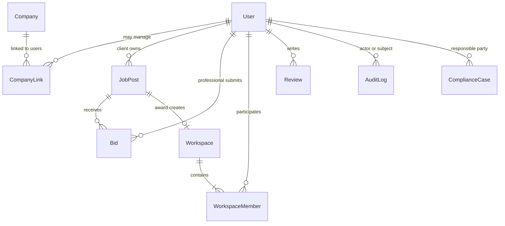
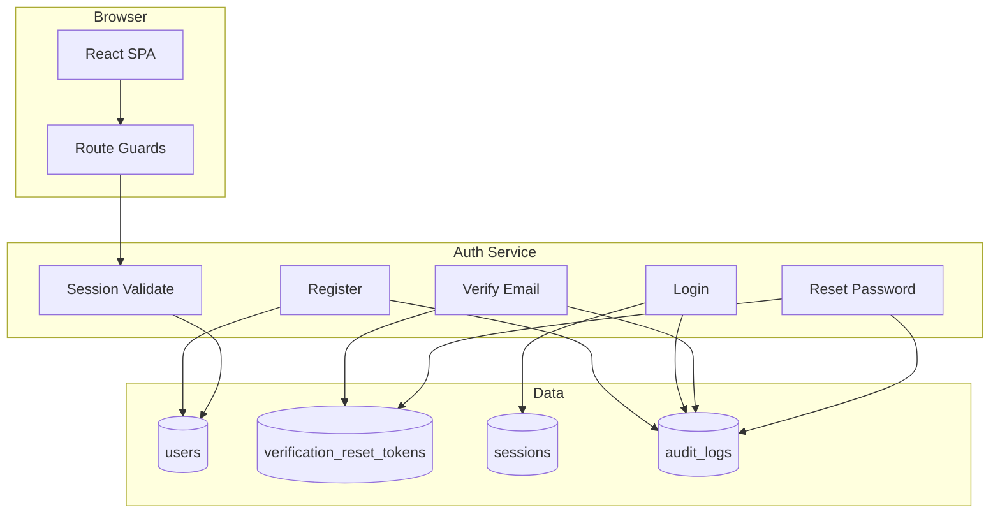
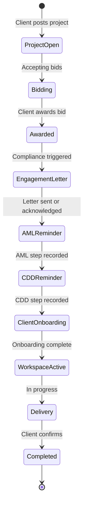
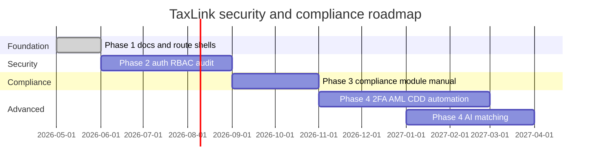

# TaxLink Security & Permission Architecture

**Status:** Source of truth  
**Version:** 1.0  
**Date:** May 2026  
**Audience:** Engineering, product, compliance, security review

This document is the **canonical reference** for TaxLink identity, authentication, authorization, ownership, compliance workflow, and audit requirements. When other documents conflict, **this document wins**.

Supporting detail and implementation plans:

- [security-roadmap.md](./security-roadmap.md) — Phase 2 delivery sequence  
- [taxlink-permission-matrix.md](./taxlink-permission-matrix.md) — exhaustive route/feature CRUD matrix  
- [permission-matrix-audit.md](./permission-matrix-audit.md) — as-built gap analysis  
- [taxlink-v1-product-architecture.md](./taxlink-v1-product-architecture.md) — product layers and route map  

---

## 1. User model

### 1.1 Design principles

| Principle | Rule |
|-----------|------|
| Primary entity | **User** — a natural person with a TaxLink account |
| Login identity | One **email + password** per user; no company-level login |
| Marketplace role | Exactly one primary role: `professional` \| `client` \| `admin` |
| Guest | Unauthenticated session — **not** a persisted User record |
| Attachments | Projects, bids, workspaces, reviews, compliance records, audit logs → **`user_id`** |
| Companies | Optional **attributes or linked records** — never authentication principals |

### 1.2 Roles

#### Guest

| Attribute | Value |
|-----------|-------|
| Definition | Visitor without a valid authenticated session |
| Persisted | No |
| Capabilities | View public acquisition and community read surfaces only |
| Restrictions | No marketplace writes; no workspace access; no bid or project ownership |

#### Professional

| Attribute | Value |
|-----------|-------|
| Definition | Individual tax/accounting practitioner using TaxLink to find work and deliver engagements |
| Primary activities | Browse projects, submit bids, collaborate in workspaces, access Professional Lounge |
| Firm context | Optional `firm_name`, credentials, visibility — profile data, not a login |
| Restrictions | Cannot post client projects; cannot view competitors’ bids; no admin or cross-tenant access |

#### Client

| Attribute | Value |
|-----------|-------|
| Definition | Individual or business representative posting projects and awarding work |
| Primary activities | Post projects, review bids, award professionals, collaborate in workspaces, complete compliance steps |
| Company context | May link **one or more companies** to their account (see §4); company does not own login |
| Restrictions | Cannot submit bids; cannot access Professional Lounge; bid visibility limited to **own** projects |

#### Admin

| Attribute | Value |
|-----------|-------|
| Definition | TaxLink platform operator (founders, support, compliance oversight) |
| Primary activities | User management, project oversight, audit log access, platform settings |
| Restrictions | Admin actions must be logged; no impersonation without explicit audited “support mode” (future) |

### 1.3 User entity schema (canonical)

| Field | Type | Required | Description |
|-------|------|:--------:|-------------|
| `id` | UUID | ✓ | Stable `user_id` — foreign key across platform |
| `email` | string | ✓ | Unique, normalized lowercase; login identifier |
| `password_hash` | string | ✓ | Argon2id or bcrypt; never exposed |
| `role` | enum | ✓ | `professional` \| `client` \| `admin` |
| `verification_status` | enum | ✓ | `unverified` \| `email_pending` \| `verified` \| `suspended` |
| `account_status` | enum | ✓ | `active` \| `inactive` \| `suspended` \| `closed` |
| `created_at` | timestamptz | ✓ | Account creation |
| `last_login_at` | timestamptz | | Last successful authentication |
| `updated_at` | timestamptz | ✓ | Record mutation timestamp |

### 1.4 Profile extensions (`user_profiles` or embedded)

| Field | Applies to | Notes |
|-------|------------|-------|
| `full_name` | All | Display name |
| `phone` | All | Visibility controlled by policy |
| `firm_name` | Professional | Practice name — not a login entity |
| `visibility` | Professional | `private` \| `hidden` \| `public` (directory) |
| `onboarding_completed_at` | All | Marketplace onboarding complete |
| `professional_credentials` | Professional | ACCA, ACA, etc. |

### 1.5 Role capability summary

| Capability | Guest | Professional | Client | Admin |
|------------|:-----:|:------------:|:------:|:-----:|
| View public pages | ✓ | ✓ | ✓ | ✓ |
| Browse open projects | ✓ | ✓ | ✓ | ✓ |
| Submit bids | | ✓ | | |
| View own bids | | ✓ | | ✓ |
| View all bids on a project | | **✗** | Own projects | ✓ |
| Post projects | | | ✓ | ✓ |
| Award bids | | | Own only | ✓ |
| Access own workspaces | | ✓ | ✓ | ✓ |
| Access others’ workspaces | **✗** | **✗** | **✗** | ✓ |
| Professional Lounge | Teaser | ✓ | **✗** | ✓ |
| Compliance hub | | ✓ | ✓ | ✓ |
| Manage users / audit logs | | | | ✓ |



---

## 2. Authentication model

Authentication establishes **who** the user is. Authorization (§3) establishes **what** they may do. The server is the trust boundary; the SPA must not be the sole authority.

### 2.1 Email and password (required)

| Requirement | Specification |
|-------------|---------------|
| Registration | `POST /api/v1/auth/register` — email, password, role, profile minimum |
| Login | `POST /api/v1/auth/login` — issues session (HttpOnly cookie recommended) or JWT + refresh |
| Logout | `POST /api/v1/auth/logout` — revokes session server-side |
| Password storage | Argon2id or bcrypt (cost ≥ 12); never log or return plaintext |
| Password policy | Minimum 12 characters; breach list check recommended |
| Account states | `suspended` / `closed` users cannot authenticate |
| Enumeration | Login and reset flows return generic errors |

**Session payload (`GET /auth/me`):**

```json
{
  "id": "uuid",
  "email": "user@example.com",
  "role": "professional",
  "verification_status": "verified",
  "account_status": "active"
}
```

### 2.2 Email verification (required before marketplace writes)

| State | Meaning | User experience |
|-------|---------|-----------------|
| `unverified` | Account created; no email sent yet | Prompt to verify |
| `email_pending` | Verification email sent | Banner + resend option |
| `verified` | Email ownership confirmed | Full gated access |
| `suspended` | Admin or abuse hold | Login may work; actions blocked |

**Flow:**

1. Register → send single-use token (TTL 24–72h)  
2. User clicks link → `POST /auth/verify-email`  
3. Status → `verified`; audit `auth.verify_email.success`

**Gating — requires `verification_status === verified`:**

| Action |
|--------|
| Post project |
| Submit bid |
| Award bid |
| Workspace messages / files |
| Compliance record submission |
| Admin actions |

Public read (browse projects, directory, resources) does **not** require verification.

### 2.3 Password reset (required)

| Step | Endpoint | Notes |
|------|----------|-------|
| Request | `POST /auth/forgot-password` | Always HTTP 200; token if account exists |
| Reset | `POST /auth/reset-password` | Single-use token, TTL ≤ 1h |
| Post-reset | Revoke all sessions | Force re-login |

**SPA routes:** `/forgot-password`, `/reset-password?token=`

Audit events: `auth.password_reset_requested`, `auth.password_reset_completed`

### 2.4 Future two-factor authentication (2FA)

**Status:** Planned — not in Phase 2 MVP.

| Aspect | Target design |
|--------|---------------|
| Methods | TOTP (authenticator app); SMS/email OTP as fallback (policy TBD) |
| Enrollment | Opt-in for professionals/clients; **required** for admin accounts |
| Step-up | Required for award, password change, admin user management |
| Recovery | Backup codes; audited admin recovery |
| Schema hook | `users.mfa_enabled`, `users.mfa_method`, `mfa_secrets` (encrypted) |

See §7 Future roadmap.

### 2.5 Authentication architecture diagram



---

## 3. Permission model

Authorization uses **defense in depth**: route guards (UX) + API policy enforcement (security). **Deny by default.**

### 3.1 Policy structure

```typescript
type Permission = {
  resource: 'project' | 'bid' | 'workspace' | 'review' | 'compliance' | 'user' | 'audit_log';
  action: 'view' | 'list' | 'create' | 'edit' | 'delete' | 'award' | 'shortlist';
  scope?: 'own' | 'member' | 'all';
};
```

Evaluation order:

1. Authenticate session  
2. Check `account_status` and `verification_status`  
3. Evaluate RBAC role permissions  
4. Apply ABAC: ownership (`owner_id`), workspace membership, resource state  

### 3.2 Route permissions (SPA)

Route guards read from `/auth/me` — **not** `localStorage.user_role` alone.

| Class | Guard | Examples |
|-------|-------|----------|
| **Public** | None | `/`, `/jobs`, `/professionals`, `/resources` |
| **Auth** | `requireAuth` | `/dashboard`, `/my-profile` |
| **Verified** | `requireVerifiedEmail` | All marketplace writes |
| **Role: professional** | `requireRole('professional')` | `/my-bids`, `/lounge` |
| **Role: client** | `requireRole('client')` | `/post-job`, `/my-projects`, `/project-owner-bids/:id` |
| **Role: admin** | `requireRole('admin')` | `/admin`, `/admin/*` |
| **Owner** | `requireProjectOwner` | Owner bid review (API re-validates) |
| **Dev only** | `requireAdmin` + env | `/dev/data-sync` |

#### Route matrix (summary)

| Route | Guest | Pro | Client | Admin |
|-------|:-----:|:---:|:------:|:-----:|
| `/`, `/jobs`, `/professionals`, `/resources` | ✓ | ✓ | ✓ | ✓ |
| `/login`, `/register`, `/forgot-password` | ✓ | redirect if authed | redirect | redirect |
| `/my-bids`, `/lounge` | ✗ | ✓ | ✗ | ✓ |
| `/post-job`, `/my-projects` | ✗ | ✗ | ✓ | ✓ |
| `/project-owner-bids/:id` | ✗ | ✗ | ✓ owner | ✓ |
| `/workspaces`, `/workspace/:id` | ✗ | ✓ member | ✓ member | ✓ |
| `/compliance/*` | ✗ | ✓ | ✓ | ✓ |
| `/admin/*` | ✗ | ✗ | ✗ | ✓ |

Full CRUD detail: [taxlink-permission-matrix.md](./taxlink-permission-matrix.md)

### 3.3 API permissions (enforcement layer)

Every mutation and sensitive read passes through policy middleware:

```
Request → authenticate → authorize(resource, action, context) → handler → audit
```

| Resource | Action | Guest | Pro | Client | Admin | Scope rule |
|----------|--------|:-----:|:---:|:------:|:-----:|------------|
| `project` | `list` (open) | ✓ | ✓ | ✓ | ✓ | Public filter |
| `project` | `create` | | | ✓ | ✓ | Verified |
| `project` | `update`, `delete` | | | ✓ | ✓ | `owner_id === user.id` |
| `project` | `award` | | | ✓ | ✓ | Owner + not already awarded |
| `bid` | `create` | | ✓ | | ✓ | Pro, verified, bidding open |
| `bid` | `list` | | ✓ own | ✓ own project | ✓ | **See bid isolation below** |
| `bid` | `view` | | ✓ own | ✓ owner | ✓ | Masked pre-award |
| `workspace` | `view`, `list` | | ✓ | ✓ | ✓ | Member only |
| `workspace` | `message.create`, `file.create` | | ✓ | ✓ | ✓ | Member + verified |
| `workspace` | `status.update` | | ✓ pro | | ✓ | Pro member |
| `workspace` | `completion.confirm` | | | ✓ | ✓ | Client member |
| `review` | `create` | | | ✓ | ✓ | Owner + completed project |
| `compliance` | `view`, `update` | | ✓ | ✓ | ✓ | Engagement party |
| `user` | `manage` | | | | ✓ | Admin |
| `audit_log` | `list` | | | | ✓ | Admin |

**Deny response:** `403` with code `FORBIDDEN` or `EMAIL_NOT_VERIFIED`. Log `permission.denied` (sampled).

#### Bid visibility (mandatory)

| Viewer | `GET /projects/:id/bids` |
|--------|--------------------------|
| Guest | Deny (or public bid **count** only) |
| Professional | **`bidder_id === auth.user_id` only** — never competitors |
| Client | All bids **if** `project.owner_id === auth.user_id` |
| Admin | All |

### 3.4 Workspace permissions

Workspace access is **membership-based**, not email-string matching.

#### Data model

```
workspace_members
  id, workspace_id, user_id, role (client | professional), joined_at
```

#### Rules

| Action | Policy |
|--------|--------|
| List workspaces | Workspaces where ∃ `workspace_members.user_id = auth.user_id` |
| View workspace | Member required |
| Send message | Member + verified |
| Upload file | Member + verified; size/type limits |
| Request documents | Professional member |
| Update workflow status | Professional member |
| Mark work complete | Professional member |
| Confirm completion | Client member |
| Submit in-workspace review | Member after completion unlocked |

**Prohibited:**

- Listing workspaces by “any awarded project in store” without member check  
- Granting role from `localStorage.user_role` alone  
- Workspace store mutations without API authorization  

#### Workspace role matrix (in-room)

| Feature | Client member | Professional member |
|---------|:-------------:|:-------------------:|
| View room | ✓ | ✓ |
| Messages | ✓ | ✓ |
| Upload files | ✓ | ✓ |
| Request documents | | ✓ |
| Mark files reviewed | | ✓ |
| Update status | | ✓ |
| Mark work complete | | ✓ |
| Confirm completion | ✓ | |
| Mutual review | ✓ | ✓ |

---

## 4. Ownership model

### 4.1 User owns account

| Rule | Detail |
|------|--------|
| Account owner | The **User** identified by `user_id` owns their credentials, profile, and session |
| Transfer | Account transfer requires admin process + audit |
| Deletion | `account_status: closed` — soft delete; retain audit/compliance records per retention policy |

### 4.2 User may own multiple companies

Companies are **business context**, not authentication principals.

```
companies
  id, legal_name, company_number, registered_address, created_at

company_links
  id, company_id, user_id, relationship (owner | director | authorised_representative),
  is_primary, created_at
```

| Rule | Detail |
|------|--------|
| Multiple companies | A **client** user may link **zero or more** companies |
| Posting context | `JobPost` references optional `company_id` when posted on behalf of a business |
| Professional firms | `firm_name` on profile — not a `companies` row unless expanded later |
| Permissions | **User** permissions derive from role + ownership; company link affects **display and compliance**, not login |

### 4.3 Company does not own login

| Anti-pattern | Correct model |
|--------------|---------------|
| `company@taxlink.com` shared login | Each person has their own User |
| Company UUID as session subject | User UUID as session subject |
| Role stored on company | Role stored on user |
| Workspace access via company membership alone | Workspace access via **user** in `workspace_members` |

**Project ownership:**

```
JobPost.owner_id → users.id   (the client user who posted)
JobPost.company_id → companies.id   (optional business context)
```

Award, bid review, and compliance workflows always authorize against **`owner_id` (user)**, with company as metadata.

---

## 5. Compliance workflow

Compliance runs **after acquisition, before and during delivery**. Phase 1 registers routes only; this section defines the **target workflow** and permissions.

### 5.1 Workflow overview



### 5.2 Step definitions

| Step | Trigger | Responsible | Route (foundation) | Phase |
|------|---------|-------------|-------------------|-------|
| **Award project** | Client selects winning bid | Client (owner) | `/project-owner-bids/:id` | Live (legacy) → secured in Phase 2 |
| **Engagement letter** | Award confirmed | Client + Professional | `/compliance/engagement-letter` | Stub → manual/template Phase 3 |
| **AML reminder** | Post-award or pre-workspace | Both parties | `/compliance/aml` | Reminder/checklist only; **no automation** in foundation |
| **CDD reminder** | After AML acknowledgment | Both parties | `/compliance/cdd` | Reminder/checklist only; **no automation** in foundation |
| **Client onboarding** | CDD requirements identified | Client (+ pro support) | `/compliance` hub | Document collection checklist |

### 5.3 Compliance case model (target)

```
compliance_cases
  id, project_id, workspace_id, status, created_at

compliance_steps
  id, case_id, step_type (engagement_letter | aml | cdd | onboarding),
  status (pending | in_progress | complete | waived),
  assigned_user_id, due_at, completed_at, metadata
```

### 5.4 Permissions by step

| Step | Client (owner) | Professional (awarded) | Admin |
|------|:--------------:|:----------------------:|:-----:|
| Award project | ✓ | ✗ | ✓ |
| View compliance case | ✓ | ✓ | ✓ |
| Engagement letter — acknowledge | ✓ | ✓ | ✓ |
| AML — record status | ✓ | ✓ | ✓ |
| CDD — upload evidence | ✓ | ✓ (support) | ✓ |
| Client onboarding — complete checklist | ✓ | view | ✓ |
| Waive step | ✗ | ✗ | ✓ (audited) |

**Gating:** Workspace full collaboration may require `compliance_steps.onboarding.status === complete` (configurable per engagement type — future policy flag).

### 5.5 Explicitly out of scope (foundation)

- Engagement letter **generation** (AI or auto-fill)  
- AML **automation** (PEP/sanctions screening APIs)  
- CDD **automation** (IDV vendor integration)  

These appear in §7 as future phases.

---

## 6. Audit log requirements

### 6.1 Principles

| Principle | Rule |
|-----------|------|
| Append-only | Application DB role cannot UPDATE/DELETE audit rows |
| Actor attribution | Every entry links to `actor_user_id` where known |
| No secrets | Never store passwords, tokens, or full bid text in metadata |
| Correlation | `request_id` on each entry for traceability |
| Retention | Minimum 12 months online; archive policy documented |

### 6.2 Schema

```
audit_logs
  id              UUID PK
  occurred_at     timestamptz NOT NULL
  actor_user_id   UUID NULL
  actor_role      enum NULL
  actor_ip        inet NULL
  action          string NOT NULL
  resource_type   string NULL
  resource_id     UUID NULL
  subject_user_id UUID NULL
  outcome         enum (success | failure | denied)
  metadata        jsonb
  request_id      UUID NOT NULL
```

### 6.3 Required events

#### Authentication

| Action | When |
|--------|------|
| `auth.register` | Account created |
| `auth.login.success` / `auth.login.failure` | Login attempt |
| `auth.logout` | Session ended |
| `auth.verify_email` | Email verified |
| `auth.password_reset_requested` | Reset requested |
| `auth.password_reset_completed` | Password changed |
| `auth.session.revoke` | Admin or user revoke |

#### Authorization

| Action | When |
|--------|------|
| `permission.denied` | Policy reject (sampled if high volume) |

#### Marketplace

| Action | When |
|--------|------|
| `project.create`, `project.update`, `project.delete` | Project lifecycle |
| `project.award` | Bid awarded — **critical** |
| `bid.create`, `bid.shortlist`, `bid.reject` | Bid lifecycle |

#### Workspace

| Action | When |
|--------|------|
| `workspace.create` | Created on award |
| `workspace.message.create`, `workspace.file.upload` | Collaboration |
| `workspace.status.change`, `workspace.completion.confirm` | Delivery milestones |

#### Compliance

| Action | When |
|--------|------|
| `compliance.step.complete`, `compliance.step.waive` | Each compliance step |

#### Admin

| Action | When |
|--------|------|
| `user.suspend`, `user.role_change`, `user.verify_override` | User admin |
| `settings.update` | Platform config |

#### Reviews

| Action | When |
|--------|------|
| `review.create` | Verified review submitted |

### 6.4 Access

| Role | Read audit logs |
|------|:-------------:|
| Guest | ✗ |
| Professional | ✗ (own activity summary — future) |
| Client | ✗ |
| Admin | ✓ via `GET /api/v1/admin/audit-logs` |

### 6.5 Implementation reference

Delivery sequence: [security-roadmap.md](./security-roadmap.md) Workstream 8.

---

## 7. Future roadmap

Items below are **planned but not part of the current foundation or Phase 2 MVP**. They must not block auth/RBAC delivery.

### 7.1 Two-factor authentication (2FA)

| Phase | Scope |
|-------|-------|
| Phase 3+ | TOTP enrollment, backup codes, admin-mandatory 2FA |
| Phase 3+ | Step-up auth for award, password change, admin actions |

### 7.2 AI matching

| Phase | Scope |
|-------|-------|
| Phase 4+ | Project-to-professional relevance scoring |
| Phase 4+ | Opt-in only; no auto-award; audit recommendations |

**Not a security control** — does not bypass permission model.

### 7.3 AML automation

| Phase | Scope |
|-------|-------|
| Phase 4+ | Integrate screening provider (sanctions / PEP) |
| Phase 4+ | Risk score on `compliance_steps.aml`; manual override with audit |

Foundation: **reminder and checklist only** (§5).

### 7.4 CDD automation

| Phase | Scope |
|-------|-------|
| Phase 4+ | IDV vendor integration |
| Phase 4+ | Automated document classification (optional) |

Foundation: **reminder and checklist only** (§5).

### 7.5 Roadmap timeline (summary)



| Phase | Deliverables |
|-------|--------------|
| **Phase 1** (current) | This document, route shells, nav config, permission matrices |
| **Phase 2** | Email/password auth, verification, reset, route guards, API RBAC, workspace/bid isolation, audit log |
| **Phase 3** | Compliance hub implementation (manual engagement letter, AML/CDD reminders, onboarding checklist) |
| **Phase 4+** | 2FA, AML/CDD automation, AI matching |

---

## 8. As-built status and enforcement gap

| Layer | Target (this document) | As-built (May 2026) |
|-------|------------------------|---------------------|
| User model | Server `users` table | localStorage session + early-access signups |
| Authentication | Email/password + verify + reset | Passwordless local restore |
| Route permissions | Guards on all protected routes | Nav-only; `ProtectedRoute` unused |
| API permissions | Policy middleware | Client-trusted stores |
| Workspace | `workspace_members` by `user_id` | Email heuristics in `workspaceAccess.js` |
| Bid visibility | Server-enforced isolation | Owner bid page public ([SEC-02](./permission-matrix-audit.md)) |
| Audit log | Append-only store | Not implemented |

**Remediation:** [security-roadmap.md](./security-roadmap.md)

---

## 9. Document governance

| Rule | Detail |
|------|--------|
| Source of truth | **This file** for security and permissions |
| Change control | Update this document before implementing permission changes |
| Matrix detail | Route/feature CRUD → [taxlink-permission-matrix.md](./taxlink-permission-matrix.md) |
| Implementation plan | Phase sequencing → [security-roadmap.md](./security-roadmap.md) |
| Gap tracking | As-built audit → [permission-matrix-audit.md](./permission-matrix-audit.md) |

When implementing a feature, engineers must confirm:

1. User model attachment (`user_id`)  
2. Auth gates (verified email if write)  
3. Route guard classification (§3.2)  
4. API policy row (§3.3)  
5. Audit events (§6.3)  

---

## 10. Document history

| Version | Date | Author | Changes |
|---------|------|--------|---------|
| 1.0 | May 2026 | TaxLink | Initial source-of-truth release |
