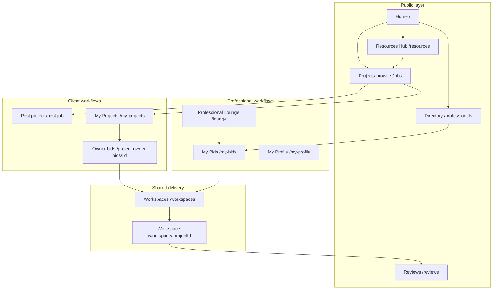

# TaxLink V1 — Proposed Architecture

**Status:** Proposal (documentation only)  
**Date:** May 2026  
**Baseline:** [current-architecture.md](./current-architecture.md)

This document defines the **target information architecture, site map, and navigation** for TaxLink V1. It preserves the four core marketplace workflows already built and adds two new product surfaces: **Professional Lounge** and **Resources Hub**. No implementation is implied by this document.

---

## 1. V1 product vision

TaxLink V1 is a **UK tax & accounting marketplace** with a full project lifecycle—discover, bid, award, collaborate, and review—plus **community and knowledge** layers that keep professionals engaged between projects and help clients make informed decisions.

| Pillar | Role in V1 |
|--------|------------|
| **Projects** | Clients post work; marketplace discovery and owner management |
| **Bids** | Professionals discover, submit, and track proposals |
| **Workspace** | Post-award delivery, messaging, files, and completion |
| **Reviews** | Trust, reputation, and post-engagement feedback |
| **Professional Lounge** *(new)* | Professional-only community, updates, and peer value |
| **Resources Hub** *(new)* | Curated guides and reference content for all users |

Supporting surfaces (unchanged in scope but reorganized in nav): **Home**, **Directory** (Find Experts), **Onboarding** (`/create-profile`), **Profiles**, and **Admin/Dev** tools.

---

## 2. Current vs V1 — at a glance

### 2.1 What stays (functional scope)

All existing marketplace behavior remains in V1. Route paths below show **today’s implementation**; V1 may add aliases or grouping without removing capability.

| Domain | Current routes (representative) | V1 label |
|--------|----------------------------------|----------|
| Projects | `/jobs`, `/post-job`, `/project/:id`, `/my-projects`, `/project-owner-bids/:id` | **Projects** |
| Bids | `/my-bids`, bid flows on `/project/:id`, `/professionals/bid/:bidId` | **Bids** |
| Workspace | `/workspaces`, `/workspace/:projectId` | **Workspace** |
| Reviews | `/reviews`, in-workspace mutual reviews | **Reviews** |

### 2.2 What is added (net-new surfaces)

| Domain | Proposed base route | Primary audience |
|--------|---------------------|------------------|
| Professional Lounge | `/lounge` | Professionals (authenticated) |
| Resources Hub | `/resources` | All users (public browse; optional save/bookmark when signed in) |

### 2.3 What is reorganized (not removed)

- **Flat navbar** → **grouped primary navigation** by user intent (Discover, My Work, Community, Account).
- **Footer** columns aligned to V1 pillars and role-based entry points.
- **Naming consistency:** “Browse Projects” / “Jobs” / “Post a Project” unified under **Projects** in IA; UI copy can stay user-friendly (“Post a project”).

---

## 3. V1 domain architecture



### 3.1 Projects (retained)

**Purpose:** Connect clients who need tax/accounting work with the open marketplace.

| Surface | Route (current → V1) | Notes |
|---------|----------------------|-------|
| Browse open projects | `/jobs` | Public discovery; filters by service type, budget, urgency |
| Post a project | `/post-job` | Client wizard; creates `JobPost` |
| Project detail | `/project/:id` | Public view; bid entry for professionals |
| My projects | `/my-projects` | Owner dashboard: status, bids, award |
| Owner bid review | `/project-owner-bids/:id` | Shortlist, reject, award |

**V1 IA improvement:** Treat these as one **Projects** family in nav and breadcrumbs, e.g. `Projects → Browse`, `Projects → Post`, `Projects → Mine`.

### 3.2 Bids (retained)

**Purpose:** Professional side of the marketplace—from discovery through award.

| Surface | Route | Notes |
|---------|-------|-------|
| My bids dashboard | `/my-bids` | Pipeline: pending, shortlisted, selected, rejected |
| Submit bid | Modal on `/project/:id` | Unchanged workflow |
| Bidder public profile | `/professionals/bid/:bidId` | Trust surface linked from owner bid review |

**V1 IA improvement:** Nav item **My Bids** visible when `user_role === professional` (or signed-in pro). Badge count (existing) stays on this item.

### 3.3 Workspace (retained)

**Purpose:** Post-award collaboration until completion and review.

| Surface | Route | Notes |
|---------|-------|-------|
| Workspace list | `/workspaces` | Filter by status; links to active delivery |
| Project workspace | `/workspace/:projectId` | Messages, files, status, completion, mutual reviews |

**V1 IA improvement:** Label nav **Workspaces** under **My Work** for both roles when user has ≥1 accessible workspace; empty state CTA points to `/jobs` (pro) or `/post-job` (client).

### 3.4 Reviews (retained)

**Purpose:** Marketplace trust—public review feed and submission tied to completed engagements.

| Surface | Route | Notes |
|---------|-------|-------|
| Reviews hub | `/reviews` | List, filters, submit (where eligible) |
| Workspace reviews | In `/workspace/:projectId` | `WorkspaceMutualReviews` after completion |

**V1 IA improvement:** Group under **Community** in primary nav alongside Resources; cross-link from Resources articles (“How reviews work”).

### 3.5 Professional Lounge (new)

**Purpose:** A **professional-only** home between projects—peer connection, platform updates, and practice growth—not client-facing work delivery.

**Access model (proposed):**

| User | Access |
|------|--------|
| Visitor | Teaser landing at `/lounge` with CTA to `/create-profile` (professional role) |
| Client | No lounge content; redirect or “Professionals only” with link to `/resources` |
| Professional (signed in) | Full lounge |

**Proposed route tree:**

```
/lounge                          → Lounge home (feed / dashboard)
/lounge/announcements            → Product & compliance updates from TaxLink
/lounge/discussions              → Peer Q&A or topic threads (category list)
/lounge/discussions/:topicId     → Thread list
/lounge/discussions/:topicId/:postId → Single thread (optional V1.1)
/lounge/network                  → Suggested peers, follow, optional DMs (V1.1)
/lounge/my-activity              → User’s posts, replies, saved threads
```

**V1 MVP scope (recommended):**

- **Home:** Welcome, quick links to My Bids, Browse Projects, Workspaces, Resources (pro section).
- **Announcements:** Static or CMS-driven updates (HMRC deadlines, platform features).
- **Discussions:** Read-only or lightly moderated categories (e.g. MTD, pricing, software); posting requires professional session.
- **Profile strip:** Link to `/my-profile` and visibility settings.

**Out of V1 MVP (document for later):** Real-time chat, DMs, CPD accreditation tracking, integrations with third-party forums.

**Data (conceptual, not implemented):** `LoungePost`, `LoungeAnnouncement`, `LoungeTopic`; storage TBD when moving beyond local-first demo.

### 3.6 Resources Hub (new)

**Purpose:** **Canonical knowledge base** for clients and professionals—searchable articles, templates, and explainers that reduce support burden and improve project quality.

**Access model:** Public read for all; optional “Save for later” when authenticated (any role).

**Proposed route tree:**

```
/resources                       → Hub home (featured, categories, search)
/resources/search?q=             → Search results
/resources/categories/:slug      → Category listing (e.g. vat, self-assessment, ltd)
/resources/:slug                 → Article detail
/resources/for-clients           → Curated landing (default client lens)
/resources/for-professionals     → Curated landing (practice, compliance, templates)
```

**Content types (V1):**

| Type | Examples | Audience |
|------|----------|----------|
| Guides | “What to prepare before your SA return” | Clients |
| Checklists | Document pack for new Ltd client | Both |
| Templates | Engagement letter outline | Professionals |
| Glossary | HMRC terms | Both |
| Platform help | How posting, bidding, and workspaces work | Both |

**Cross-links:**

- From `/post-job` → relevant “What to include in your brief” article.
- From `/lounge` → deep links to pro resources.
- From `/reviews` → “Leaving a fair review” guide.

**Data (conceptual):** `ResourceArticle`, `ResourceCategory`; static MDX or headless CMS in a future backend phase.

---

## 4. Complete site map

Legend: **bold** = new in V1 · *(existing)* = unchanged route · *(admin)* = internal

```
TaxLink
│
├── Marketing & entry
│   ├── /                          Home
│   ├── /create-profile              Onboarding (early access)
│   └── /professionals               Find Experts (directory)
│       ├── /advisor/:id             Advisor profile
│       ├── /profile/:id             Legacy profile
│       └── /professionals/:advisorId → redirect
│
├── **Community** (V1 grouping)
│   ├── **/lounge**                  Professional Lounge home
│   │   ├── **/lounge/announcements**
│   │   ├── **/lounge/discussions**
│   │   │   └── **/lounge/discussions/:topicId**
│   │   └── **/lounge/my-activity**
│   ├── **/resources**               Resources Hub home
│   │   ├── **/resources/search**
│   │   ├── **/resources/categories/:slug**
│   │   ├── **/resources/:slug**     Article
│   │   ├── **/resources/for-clients**
│   │   └── **/resources/for-professionals**
│   └── /reviews                     Reviews
│
├── Projects *(marketplace)*
│   ├── /jobs                        Browse projects
│   ├── /post-job                    Post a project
│   ├── /project/:id                 Project detail
│   ├── /my-projects                 My projects (client)
│   └── /project-owner-bids/:id      Bid management (owner)
│
├── Bids *(professional)*
│   ├── /my-bids                     My bids dashboard
│   └── /professionals/bid/:bidId    Bidder public profile
│
├── Workspace *(delivery)*
│   ├── /workspaces                  Workspace list
│   └── /workspace/:projectId        Project workspace
│
├── Account
│   └── /my-profile                  My profile (professional summary)
│
└── *(admin / dev — footer or env-gated)*
    ├── /admin                       Admin dashboard
    └── /dev/data-sync               Data sync
```

---

## 5. Navigation structure

### 5.1 Design principles

1. **Intent-first grouping** — Discover vs My Work vs Community vs Account.
2. **Role-aware visibility** — Clients never see My Bids or Lounge content; professionals see Lounge and My Bids; both see Workspaces when relevant.
3. **Stable URLs** — Existing deep links (`/jobs`, `/my-bids`, etc.) remain valid; new sections use `/lounge` and `/resources` prefixes.
4. **One primary CTA** — “Post a project” (clients) / “Browse projects” (professionals) in header; secondary CTA “Join early access” until full launch.

### 5.2 Primary navigation (desktop)

**Default order (left → right after logo):**

| Group | Items | Visible to |
|-------|-------|------------|
| **Discover** | Find Experts (`/professionals`) · Browse Projects (`/jobs`) | All |
| **Community** | Resources (`/resources`) · Reviews (`/reviews`) · Lounge (`/lounge`) | Lounge: pro only (others hidden or teaser) |
| **My Work** | My Projects (`/my-projects`) · My Bids (`/my-bids`) · Workspaces (`/workspaces`) | My Projects: client · My Bids: pro · Workspaces: both when has access |
| **Actions** (right) | Join Early Access · Post a Project Free | Contextual |

**Recommended simplification for crowded bar:** Use a **“Community”** dropdown:

- Resources  
- Reviews  
- Professional Lounge *(professionals only)*

### 5.3 Primary navigation (mobile sheet)

Same groups, vertical stack:

1. Discover (Find Experts, Browse Projects)  
2. Community (Resources, Reviews, Lounge*)  
3. My Work (My Projects*, My Bids*, Workspaces)  
4. Post a Project / Join Early Access  

\*Role-filtered items omitted when not applicable.

### 5.4 Role-based nav matrix

| Nav item | Visitor | Client | Professional |
|----------|---------|--------|--------------|
| Find Experts | ✓ | ✓ | ✓ |
| Browse Projects | ✓ | ✓ | ✓ |
| Post a Project | ✓ | ✓ | ✓ |
| Resources | ✓ | ✓ | ✓ |
| Reviews | ✓ | ✓ | ✓ |
| Professional Lounge | Teaser | — | ✓ |
| My Projects | — | ✓ | — |
| My Bids | — | — | ✓ (badge) |
| Workspaces | If access | If access | If access |
| My Profile | — | — | ✓ (account menu) |

### 5.5 Account menu (proposed V1)

Consolidate secondary links under avatar / “Account”:

- My Profile (`/my-profile`) — professionals  
- My Projects — clients  
- Workspaces  
- Saved resources *(when auth + bookmarks exist)*  
- Sign out  

### 5.6 Footer structure

| Column | Links |
|--------|-------|
| **Product** | Home, How it works (anchor on `/`), Pricing (anchor) |
| **For clients** | Post a project, Find experts, Resources for clients |
| **For professionals** | Join early access, Browse projects, Lounge, Resources for professionals |
| **Trust & legal** | Reviews, About, Privacy, Terms *(placeholders until pages exist)* |

### 5.7 Breadcrumbs (V1 pattern)

| Path pattern | Example breadcrumb |
|--------------|-------------------|
| Resources | Resources → VAT → Making Tax Digital overview |
| Lounge | Lounge → Discussions → MTD |
| Projects | Projects → Browse → Project title |
| Workspace | Workspaces → {Project name} |

---

## 6. User journeys (V1)

### 6.1 Client — post to delivery

```
Home → Post a project → My Projects → Owner bids → Award
  → Workspaces → Workspace detail → Complete → Reviews
```

Resources touchpoints: pre-post checklist (`/resources/for-clients`); post-award “What happens in workspace” article.

### 6.2 Professional — discover to delivery

```
Home / Lounge → Browse projects → Project detail → Submit bid
  → My Bids → (awarded) → Workspaces → Workspace detail → Reviews
```

Lounge touchpoints: announcements for deadline seasons; discussions for pricing/scoping; link to pro resources.

### 6.3 Visitor — trust before signup

```
Home → Resources / Reviews → Find Experts → Create profile
```

---

## 7. Information architecture diagram

```
┌──────────────────────────────────────────────────────────────────────────┐
│                         TAXLINK V1 — TOP LEVEL                            │
├─────────────┬─────────────┬─────────────┬─────────────┬──────────────────┤
│  DISCOVER   │  PROJECTS   │    BIDS     │  WORKSPACE  │    COMMUNITY     │
│             │  (client +  │    (pro)    │  (shared)   │                  │
│  Directory  │  marketplace)│             │             │  Resources Hub   │
│  Jobs browse│             │             │             │  Reviews         │
│             │             │             │             │  Prof. Lounge    │
└─────────────┴─────────────┴─────────────┴─────────────┴──────────────────┘
                              │
                    Award connects Projects/Bids → Workspace
                              │
                    Completion connects Workspace → Reviews
```

---

## 8. Entity & integration notes (forward-looking)

No schema changes in this proposal. When implementing V1 backend:

| Existing entity | V1 relationship |
|-----------------|-----------------|
| `JobPost` | Projects domain |
| `Bid` | Bids domain |
| `Workspace` | Workspace domain |
| `Review` | Reviews + optional link from workspace completion |
| **New** `ResourceArticle` | Resources Hub |
| **New** `LoungeTopic` / `LoungePost` | Professional Lounge |

`reconcileMarketplaceState()` and workspace access rules remain scoped to Projects/Bids/Workspace; Lounge and Resources are **read-heavy** and can ship as static content before shared entity store migration.

---

## 9. Implementation phasing (recommended)

| Phase | Deliverable |
|-------|-------------|
| **V1.0 — IA & nav** | Grouped nav/footer; `/resources` and `/lounge` shells with static content |
| **V1.1 — Resources** | Categories, search, article pages, cross-links from post-job and reviews |
| **V1.2 — Lounge** | Announcements + discussions (professional gate) |
| **V1.3 — Auth hardening** | Route guards for lounge, owner pages, admin; server-backed permissions |

---

## 10. Success metrics (V1)

| Area | Signal |
|------|--------|
| Projects | Posted projects, award rate |
| Bids | Bids per open project, pro repeat bid rate |
| Workspace | Time to completion, message/file activity |
| Reviews | Reviews submitted post-completion |
| Resources Hub | Article views, search queries, click-through to post-job |
| Professional Lounge | Weekly active professionals, discussion posts |

---

## 11. Related documents

- [current-architecture.md](./current-architecture.md) — As-built routes, entities, workflows, permissions  
- [DEPLOYMENT.md](../DEPLOYMENT.md) — Hosting and SPA routing  

---

## Appendix A — Route migration map

| Current path | V1 canonical | Action |
|--------------|----------------|--------|
| `/jobs` | `/jobs` | Keep |
| `/post-job` | `/post-job` | Keep |
| `/my-projects` | `/my-projects` | Keep |
| `/my-bids` | `/my-bids` | Keep |
| `/workspaces` | `/workspaces` | Keep |
| `/workspace/:projectId` | `/workspace/:projectId` | Keep |
| `/reviews` | `/reviews` | Keep |
| — | `/lounge` | **Add** |
| — | `/resources` | **Add** |
| `/professionals` | `/professionals` | Keep (Discover) |

Optional future aliases (not required for V1): `/projects` → `/jobs`, `/projects/post` → `/post-job`.

---

## Appendix B — Navbar wireframe (ASCII)

```
[Logo TaxLink]  Discover ▾          Community ▾         My Work ▾     [Early Access] [Post Project]
                  · Find Experts       · Resources         · My Projects*
                  · Browse Projects    · Reviews           · My Bids*
                                       · Lounge*           · Workspaces
```

\*Shown based on role and access.
