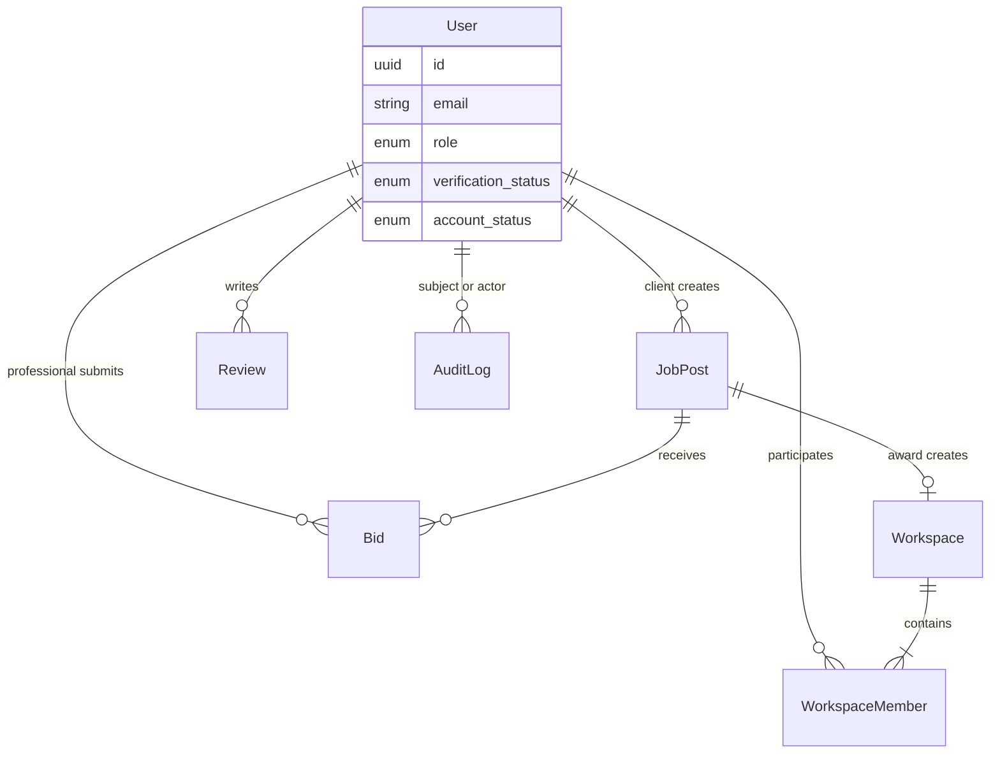
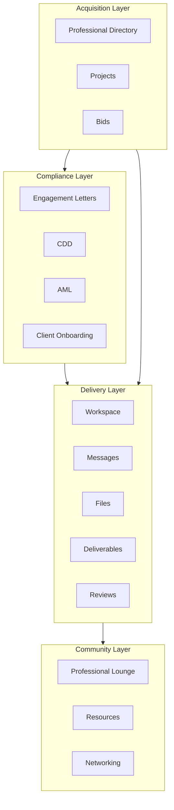
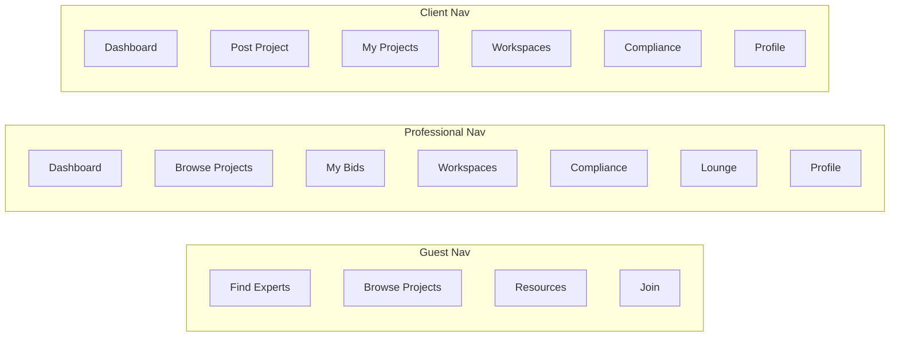

# TaxLink V1 — Product Architecture (Foundation)

**Status:** Phase 1 foundation  
**Date:** May 2026  
**Scope:** User model, permissions, product layers, route map, navigation, roadmap  
**Out of scope (Phase 1):** AI matching, engagement letter generation, AML/CDD automation, reputation system, 2FA

Related: [taxlink-v1-architecture.md](./taxlink-v1-architecture.md) · [taxlink-permission-matrix.md](./taxlink-permission-matrix.md) · [permission-matrix-audit.md](./permission-matrix-audit.md)

---

## 1. Foundation objective

TaxLink V1 Phase 1 establishes a **scalable skeleton** for future development:

- A canonical **User** entity (individual-first; firms as profile attributes)
- A formal **permission matrix** with RBAC-ready design
- Four **product layers** (Acquisition, Compliance, Delivery, Community)
- **Placeholder routes and role-based navigation** — “Coming Soon” shells without business logic
- **Legacy marketplace routes preserved** (`/jobs`, `/my-bids`, etc.) until migrated

No advanced compliance or matching features are built in this phase.

---

## 2. User model

### 2.1 Principles

| Principle | Rule |
|-----------|------|
| Primary entity | **User** (natural person) |
| Firms | Optional **profile attributes** (`firm_name`, `company_number`) — not login entities |
| Attachments | Permissions, workspaces, reviews, audit logs, bids, projects → **user_id** |
| Roles | One primary marketplace role per account: `professional` \| `client` \| `admin` |
| Guest | Unauthenticated browser session — not persisted as User |

### 2.2 Core User schema (target)

| Field | Type | Required | Description |
|-------|------|:--------:|-------------|
| `id` | UUID | ✓ | Stable user ID (`user_id`) |
| `email` | string | ✓ | Unique login identifier; normalized lowercase |
| `password_hash` | string | ✓ | Never stored or returned in plaintext |
| `role` | enum | ✓ | `guest` (session only) \| `professional` \| `client` \| `admin` |
| `verification_status` | enum | ✓ | `unverified` \| `email_pending` \| `verified` \| `suspended` |
| `created_at` | ISO datetime | ✓ | Account creation |
| `last_login_at` | ISO datetime | | Updated on successful auth |
| `account_status` | enum | ✓ | `active` \| `inactive` \| `suspended` \| `closed` |

### 2.3 Optional profile extensions (same User record or `user_profiles`)

| Field | Applies to | Notes |
|-------|------------|-------|
| `full_name` | All | Display name |
| `firm_name` | Professional | Not a separate org login |
| `company_name` | Client | Business client context |
| `phone` | All | Contact; visibility rules apply |
| `visibility` | Professional | `private` \| `hidden` \| `public` (directory) |
| `onboarding_completed_at` | All | Early access / KYC gate |

### 2.4 Entity relationships



### 2.5 Current vs target (as-built note)

Today the app uses `taxlink_auth_session`, `user_role`, and `my_profile` in **localStorage**. Phase 1 documentation defines the **target User model**; migration to server-backed users is Phase 2+.

---

## 3. Permission model

### 3.1 Design rules

1. **Deny by default** — explicit grant per role + resource
2. **Ownership** — client `user_id === project.owner_id` for award/edit
3. **Membership** — workspace access only via `WorkspaceMember`
4. **Bid isolation** — professionals see **own** bids only, never competitors’ bids on the same project
5. **Extensibility** — permissions stored as `{ resource, action, scope }` for future RBAC/ABAC

### 3.2 Role capability summary

| Capability | Guest | Professional | Client | Admin |
|------------|:-----:|:------------:|:------:|:-----:|
| View public pages | ✓ | ✓ | ✓ | ✓ |
| Browse projects (public listing) | ✓ | ✓ | ✓ | ✓ |
| Submit bids | | ✓ | | |
| View own bids | | ✓ | | ✓ |
| View others’ bids on a project | | **✗** | Own projects only | ✓ |
| Post projects | | | ✓ | ✓ |
| Review / compare bids (owner) | | | Own only | ✓ |
| Award bids | | | Own only | ✓ |
| Access own workspaces | | ✓ | ✓ | ✓ |
| Access others’ workspaces | **✗** | **✗** | **✗** | ✓ (support) |
| Professional Lounge | Teaser | ✓ | **✗** | ✓ |
| Resources (read) | ✓ | ✓ | ✓ | ✓ |
| Compliance hub | | ✓ | ✓ | ✓ |
| Manage users | | | | ✓ |
| Manage all projects | | | | ✓ |
| Audit logs | | | | ✓ |

### 3.3 Formal permission matrix (routes)

Legend: **V** View · **C** Create · **E** Edit · **D** Delete · **—** Not allowed · **Own** Scoped to own records · **Member** Workspace member

#### Public / acquisition

| Route | Guest | Professional | Client | Admin | Restrictions |
|-------|:-----:|:------------:|:------:|:-----:|--------------|
| `/` | V | V | V | V | Public |
| `/professionals` | V | V | V | V | Public directory |
| `/jobs`, `/projects` | V | V | V | V | Browse; `/projects` = foundation stub |
| `/project/:id` | V | V | V | V | Public brief; bid **C** = pro only |
| `/resources` | V | V | V | V, E | Admin manages content (future CMS) |
| `/create-profile` | V, C | V, C | V, C | V | Onboarding |

#### Professional

| Route | Guest | Professional | Client | Admin | Restrictions |
|-------|:-----:|:------------:|:------:|:-----:|--------------|
| `/dashboard` | — | V | V* | V | *Client dashboard shell; role-specific UX later |
| `/my-bids` | — | V, Own | — | V | **Own bids only** |
| `/lounge` | Teaser | V | — | V, E | Pro-only full access |

#### Client

| Route | Guest | Professional | Client | Admin | Restrictions |
|-------|:-----:|:------------:|:------:|:-----:|--------------|
| `/post-job` | — | — | V, C | V, C | Client posts |
| `/my-projects` | — | — | V, Own | V | Own projects |
| `/project-owner-bids/:id` | — | — | V, E Own | V | **Owner only** — award |

#### Shared delivery

| Route | Guest | Professional | Client | Admin | Restrictions |
|-------|:-----:|:------------:|:------:|:-----:|--------------|
| `/workspaces` | — | V Member | V Member | V | Member list |
| `/workspace/:projectId` | — | V Member | V Member | V | **Members only** |

#### Compliance (foundation stubs)

| Route | Guest | Professional | Client | Admin | Restrictions |
|-------|:-----:|:------------:|:------:|:-----:|--------------|
| `/compliance` | — | V | V | V, E | No automation in Phase 1 |
| `/compliance/engagement-letter` | — | V | V | V, E | Placeholder |
| `/compliance/cdd` | — | V | V | V, E | Placeholder |
| `/compliance/aml` | — | V | V | V, E | Placeholder |

#### Admin

| Route | Guest | Professional | Client | Admin | Restrictions |
|-------|:-----:|:------------:|:------:|:-----:|--------------|
| `/admin` | — | — | — | V | Overview (legacy dashboard) |
| `/admin/users` | — | — | — | V, E | User management |
| `/admin/projects` | — | — | — | V, E | All projects |
| `/admin/audit-logs` | — | — | — | V | Audit trail |
| `/admin/settings` | — | — | — | V, E | Platform settings |

### 3.4 Critical restrictions (enforcement targets)

| Rule | Implementation target |
|------|------------------------|
| Professionals cannot view other professionals’ bids | API: `GET /bids?project_id=` returns owner-only for clients; pro gets `bidder_id === self` only |
| Only project owners award bids | `POST /projects/:id/award` requires `auth.user_id === project.owner_id` |
| Workspace members only | `GET /workspaces/:id` validates `WorkspaceMember` |
| Future RBAC | `permissions[]` on User or role-permission table; route guards read from policy service |

---

## 4. Product architecture — four layers



### 4.1 Acquisition layer

**Purpose:** Match clients with professionals — discover, post, bid, award.

| Module | Route(s) | Phase 1 status |
|--------|----------|----------------|
| Projects | `/projects`, `/jobs`, `/post-job`, `/my-projects` | `/projects` stub; `/jobs` live |
| Bids | `/my-bids`, `/project/:id` (bid modal) | Live (legacy) |
| Professional Directory | `/professionals`, `/advisor/:id` | Live (legacy) |

**Future expansion:** Search filters, saved projects, project templates, fee transparency, conflict checks.

### 4.2 Compliance layer

**Purpose:** Regulatory and engagement readiness before and during delivery.

| Module | Route | Phase 1 status |
|--------|-------|----------------|
| Compliance hub | `/compliance` | **Placeholder** |
| Engagement letters | `/compliance/engagement-letter` | **Placeholder** — no generation |
| CDD | `/compliance/cdd` | **Placeholder** — no automation |
| AML | `/compliance/aml` | **Placeholder** — no automation |
| Client onboarding | (within compliance / post-award) | Documented only |

**Future expansion:** Template library, e-sign, ID verification integrations, risk scoring, audit trail per engagement.

### 4.3 Delivery layer

**Purpose:** Execute work after award — collaborate, file, complete, review.

| Module | Route | Phase 1 status |
|--------|-------|----------------|
| Workspace | `/workspaces`, `/workspace/:projectId` | Live (legacy) |
| Messages | In workspace | Live |
| Files | In workspace | Live |
| Deliverables | In workspace (progress/completion) | Partial |
| Reviews | `/reviews` + in-workspace | Live (legacy) |

**Future expansion:** Deliverable checklist, versioned files, SLA timers, mutual review enforcement.

### 4.4 Community layer

**Purpose:** Retain professionals between projects; educate all users.

| Module | Route | Phase 1 status |
|--------|-------|----------------|
| Professional Lounge | `/lounge` | **Placeholder** |
| Resources | `/resources` | **Placeholder** |
| Networking | `/lounge` (future sub-routes) | Documented only |

**Future expansion:** Discussions, announcements, CPD tracking, bookmarks, moderated Q&A.

---

## 5. Route map

### 5.1 Complete sitemap

```
TaxLink V1
│
├── Public
│   ├── /                          Home
│   ├── /professionals               Find Experts
│   ├── /jobs                        Browse Projects (live)
│   ├── /projects                    Projects hub (foundation stub)
│   ├── /resources                   Resources (stub)
│   ├── /create-profile              Join / onboarding
│   └── /advisor/:id                 Adviser profile
│
├── Professional
│   ├── /dashboard                   Dashboard (stub)
│   ├── /my-bids                     My Bids (live)
│   └── /lounge                      Professional Lounge (stub)
│
├── Client
│   ├── /dashboard                   Dashboard (stub)
│   ├── /post-job                    Post Project (live)
│   └── /my-projects                 My Projects (live)
│
├── Shared authenticated
│   ├── /workspaces                  Workspace list (live)
│   ├── /workspace/:projectId        Workspace detail (live)
│   ├── /my-profile                  Profile (live)
│   └── /compliance                  Compliance hub (stub)
│       ├── /compliance/engagement-letter
│       ├── /compliance/cdd
│       └── /compliance/aml
│
├── Legacy (preserved)
│   ├── /project/:id
│   ├── /project-owner-bids/:id
│   ├── /reviews
│   ├── /admin                       Admin overview (live)
│   └── /dev/data-sync
│
└── Admin (foundation stubs)
    ├── /admin/users
    ├── /admin/projects
    ├── /admin/audit-logs
    └── /admin/settings
```

### 5.2 Foundation routes registered in app

| Path | Component | Content |
|------|-----------|---------|
| `/projects` | `ComingSoonPage` | Acquisition layer stub |
| `/dashboard` | `ComingSoonPage` | Role-agnostic dashboard shell |
| `/compliance` | `ComingSoonPage` | Compliance hub |
| `/compliance/engagement-letter` | `ComingSoonPage` | Engagement letters |
| `/compliance/cdd` | `ComingSoonPage` | CDD |
| `/compliance/aml` | `ComingSoonPage` | AML |
| `/lounge` | `ComingSoonPage` | Professional Lounge |
| `/resources` | `ComingSoonPage` | Resources Hub |
| `/admin/users` | `ComingSoonPage` | User management |
| `/admin/projects` | `ComingSoonPage` | Project admin |
| `/admin/audit-logs` | `ComingSoonPage` | Audit logs |
| `/admin/settings` | `ComingSoonPage` | Settings |

---

## 6. Navigation map

Navigation is defined in `src/lib/navigationConfig.js` and rendered in `Navbar.jsx`.

### 6.1 Guest

| Item | Path |
|------|------|
| Find Experts | `/professionals` |
| Browse Projects | `/jobs` |
| Resources | `/resources` |
| Join (CTA) | `/create-profile` |

### 6.2 Authenticated professional

| Item | Path |
|------|------|
| Dashboard | `/dashboard` |
| Browse Projects | `/jobs` |
| My Bids | `/my-bids` |
| Workspaces | `/workspaces` |
| Compliance | `/compliance` |
| Lounge | `/lounge` |
| Profile | `/my-profile` |

### 6.3 Authenticated client

| Item | Path |
|------|------|
| Dashboard | `/dashboard` |
| Post Project | `/post-job` |
| My Projects | `/my-projects` |
| Workspaces | `/workspaces` |
| Compliance | `/compliance` |
| Profile | `/my-profile` |

### 6.4 Admin

| Item | Path |
|------|------|
| Users | `/admin/users` |
| Projects | `/admin/projects` |
| Audit Logs | `/admin/audit-logs` |
| Settings | `/admin/settings` |

**Note:** Nav role resolves from `user.role` or `localStorage.user_role`. Route guards are **not** enforced in Phase 1 — navigation reflects target IA only.



---

## 7. Future roadmap

### Phase 1 — Foundation (current)

- [x] User model documentation
- [x] Permission matrix documentation
- [x] Four-layer product architecture
- [x] Placeholder routes + Coming Soon pages
- [x] Role-based navigation config
- [ ] Route guards (role + ownership)
- [ ] Server-backed User entity

### Phase 2 — Auth & enforcement

- Password auth, email verification, session tokens
- Implement permission matrix on API routes
- Fix gaps from [permission-matrix-audit.md](./permission-matrix-audit.md)
- Admin role in auth service
- Audit log write path

### Phase 3 — Compliance module

- Engagement letter templates (manual, not AI)
- CDD/AML checklists and status tracking
- Client onboarding workflow post-award
- Compliance dashboard in `/compliance`

### Phase 4 — Community module

- Resources CMS + search
- Professional Lounge (announcements, discussions)
- Networking (optional, scoped)

### Phase 5 — Delivery hardening

- Deliverables module
- Enforced mutual reviews
- File versioning and retention policy

### Explicitly deferred (not in V1 foundation)

| Feature | Reason |
|---------|--------|
| AI matching | Out of scope |
| Engagement letter **generation** | Automation deferred |
| AML / CDD **automation** | Automation deferred |
| Reputation system | Beyond basic reviews |
| 2FA | Phase 2+ security |

---

## 8. Technical foundation checklist

| Item | Location | Status |
|------|----------|--------|
| Coming Soon page shell | `src/components/foundation/ComingSoonPage.jsx` | Done |
| Navigation config | `src/lib/navigationConfig.js` | Done |
| Role-based Navbar | `src/components/layout/Navbar.jsx` | Done |
| Foundation routes | `src/App.jsx` | Done |
| Product architecture doc | `docs/taxlink-v1-product-architecture.md` | Done |

---

## 9. Document history

| Version | Date | Notes |
|---------|------|-------|
| 1.0 | May 2026 | Phase 1 foundation — user model, permissions, layers, routes, nav, roadmap |
